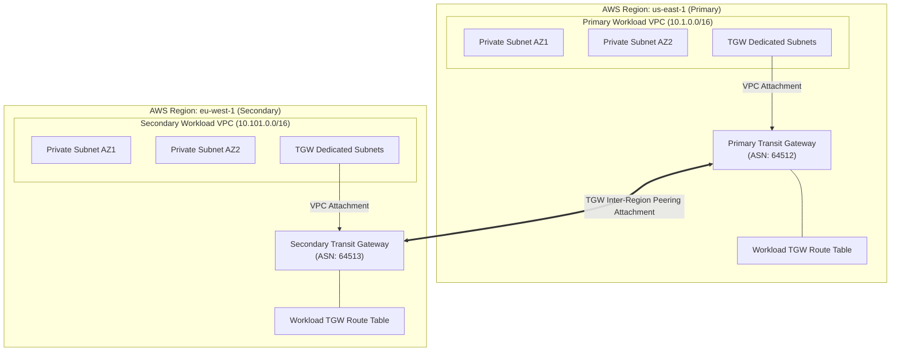

# AWS-MRTG-Mesh: Multi-Region Transit Gateway Mesh Architecture


A production-grade, highly available Infrastructure-as-Code (IaC) baseline implementing an enterprise multi-region network mesh on AWS using **AWS Transit Gateway (TGW) Peering**, isolated routing domains, and dynamic route inspection tooling.

---

## Architecture Overview

The architecture interconnects multi-AZ VPC workloads across two separate AWS regions (`us-east-1` and `eu-west-1`) over the encrypted AWS regional backbone. Custom Transit Gateway Route Tables ensure isolated traffic domains between workload tiers and cross-region transit paths.



---

## Key Features

* **Multi-Region Backbone Interconnect**: Secure cross-region transit via native AWS Transit Gateway Peering, eliminating public internet traversal.
* **Isolated Routing Domains**: Custom TGW Route Tables configured with default association/propagation disabled to strictly control cross-VPC and inter-region traffic paths.
* **Automated Peering Handshake**: End-to-end automated pairing flow, invoking both Peering Requestor (`us-east-1`) and Accepter (`eu-west-1`) resources seamlessly within single-pass Terraform orchestrations.
* **Continuous Health Audit**: Python utility using `boto3` and `tabulate` to audit route table state, detect blackhole routes, and verify dynamic peering health.
* **Production-Ready DRY Design**: Fully modularized Terraform structure with explicit provider aliasing and parameterized environment settings.

---

## Network Architecture & Allocation Matrix

| Region | Resource Component | CIDR / BGP ASN | Target Peering Destination |
| :--- | :--- | :--- | :--- |
| **`us-east-1`** | Primary TGW | `ASN: 64512` | `eu-west-1` TGW |
| **`us-east-1`** | Primary VPC | `10.1.0.0/16` | `10.101.0.0/16` via Local TGW |
| **`eu-west-1`** | Secondary TGW | `ASN: 64513` | `us-east-1` TGW |
| **`eu-west-1`** | Secondary VPC | `10.101.0.0/16` | `10.1.0.0/16` via Local TGW |

---

## Repository Structure

```text
AWS-MRTG-Mesh/
├── README.md
├── terraform/
│   ├── modules/
│   │   ├── vpc/
│   │   │   ├── main.tf
│   │   │   ├── variables.tf
│   │   │   └── outputs.tf
│   │   └── tgw/
│   │       ├── main.tf
│   │       ├── variables.tf
│   │       └── outputs.tf
│   ├── main.tf
│   ├── providers.tf
│   ├── variables.tf
│   ├── outputs.tf
│   └── terraform.tfvars.example
└── scripts/
    ├── validate_routes.py
    └── requirements.txt
```

---

## Deployment Guide

### Prerequisites

* **Terraform**: `>= 1.5.0`
* **AWS CLI**: `v2.x` configured with credentials granting permissions for EC2, VPC, and Transit Gateway resources across both regions.
* **Python**: `>= 3.10`

### Step 1: Provision Infrastructure with Terraform

```bash
# Clone repository
git clone https://github.com/abmdi/AWS-MRTG-Mesh.git
cd AWS-MRTG-Mesh/terraform

# Configure variable overrides
cp terraform.tfvars.example terraform.tfvars

# Initialize Terraform modules and multi-region providers
terraform init

# Review execution plan
terraform plan -out=tfplan

# Apply infrastructure deployment
terraform apply tfplan
```

### Step 2: Validate Route Tables and Peering Health

Execute the route validation script to query active state across both AWS regions:

```bash
# Navigate to script directory
cd ../scripts

# Create and activate virtual environment
python3 -m venv venv
source venv/bin/activate

# Install requirements
pip install -r requirements.txt

# Run route verification tool
python validate_routes.py --primary-region us-east-1 --secondary-region eu-west-1
```

For automated pipeline integration, export execution telemetry in structured JSON:

```bash
python validate_routes.py --primary-region us-east-1 --secondary-region eu-west-1 --json-output
```

---

## Verification & Monitoring Outputs

The Python validation script verifies that:
1. Inter-region **TGW Peering Attachments** are in an `available` state.
2. Route entries in each Transit Gateway correctly direct remote CIDR traffic over the peering attachment.
3. No routes are marked with `blackhole` status due to deleted or misconfigured subnets/attachments.

---

## Cleanup

To avoid ongoing charges for provisioned cloud resources:

```bash
cd terraform/
terraform destroy -auto-approve
```

---

## License

Distributed under the "MIT License". See `LICENSE` for details.
